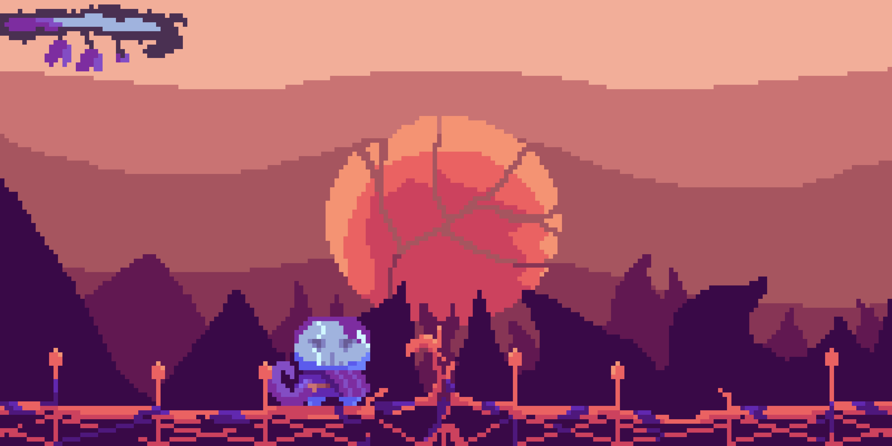
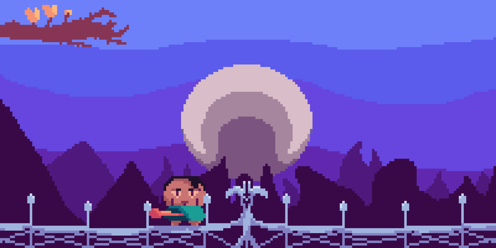
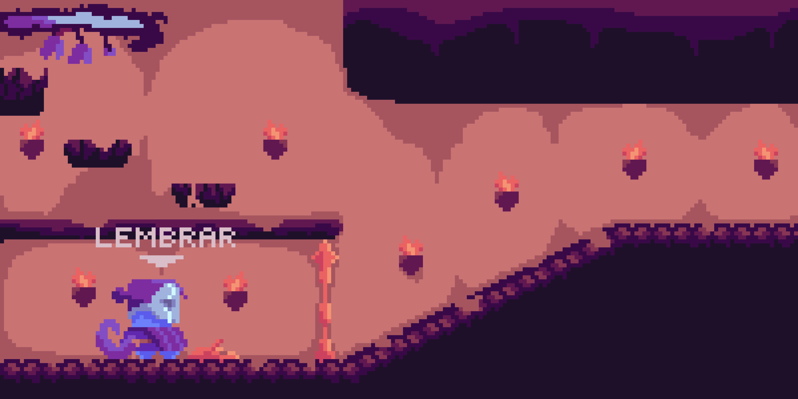

# Phantom Pain

## Tipo do Projeto
Um jogo metroidvania soulslike.

## Descrição do Projeto
Um jogo que se passa em duas realidades paralelas, presente e passado. O personagem deve caminhar pelo mapa desbloqueando novas áreas e poderes, tendo como seu objetivo descobrir o que aconteceu naquele lugar junto de seu passado.

## Mecânica Especial
Assim que morrer ou em partes específicas do jogo, você terá a opção de lembrar (voltar para o passado do personagem) ou acordar (ir para o presente). A base do mapa dos dois mundos é o mesmo tendo apenas diferenças de design e poderes (no caso dos inimigos)

## Telas
### Concept art do mundo corrompido.

### O Mesmo local no passado.

### Mecânica de Dejavu.

